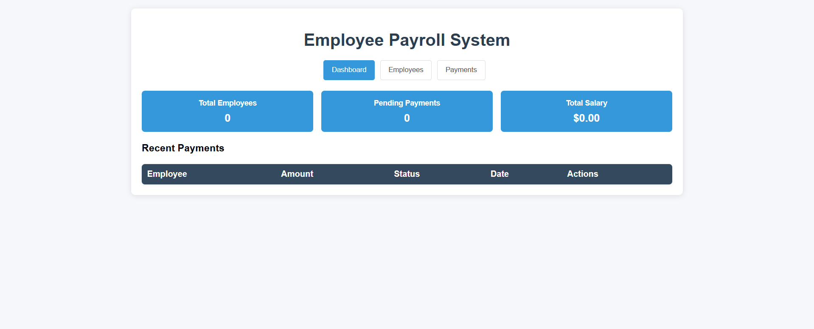
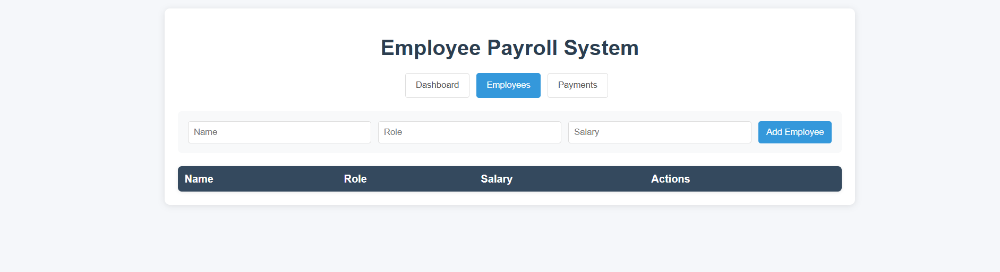
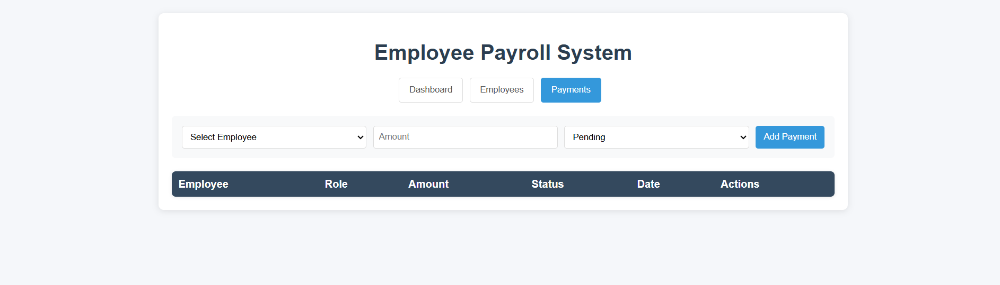

# Employee Payroll Management System



A full-stack web application for managing employee records and payroll payments built with React.js and Node.js.

## 📸 Screenshots

<div align="center">
  
  
</div>

<div align="center">
  
  
</div>

## 🚀 Features

- **Dashboard**: Real-time statistics and overview
- **Employee Management**: Add, edit, delete, and view employee records
- **Payment Tracking**: Create and manage payment records with status tracking
- **Database Integration**: MySQL database with proper relationships

## 🛠️ Tech Stack

**Frontend:**
- React.js
- CSS3
- Fetch API

**Backend:**
- Node.js
- Express.js
- MySQL2

**Database:**
- MySQL

## 📋 Prerequisites

- Node.js (v14 or higher)
- MySQL Server
- npm or yarn

## ⚙️ Installation & Setup

### 1. Clone the repository
```bash
git clone <repository-url>
cd employee-payroll-app
```

### 2. Database Setup
```sql
CREATE DATABASE payroll_db;
USE payroll_db;

CREATE TABLE employees (
  id INT AUTO_INCREMENT PRIMARY KEY,
  name VARCHAR(100) NOT NULL,
  role VARCHAR(50) NOT NULL,
  salary DECIMAL(10,2) NOT NULL
);

CREATE TABLE payments (
  id INT AUTO_INCREMENT PRIMARY KEY,
  employee_id INT NOT NULL,
  amount DECIMAL(10,2) NOT NULL,
  status ENUM('pending', 'paid', 'cancelled') DEFAULT 'pending',
  date DATETIME DEFAULT CURRENT_TIMESTAMP,
  FOREIGN KEY (employee_id) REFERENCES employees(id) ON DELETE CASCADE
);
```

### 3. Install Dependencies
```bash
# Install root dependencies
npm install

# Install backend dependencies
cd backend
npm install

# Install frontend dependencies
cd ../frontend
npm install
```

### 4. Configure Database Connection
Update the database configuration in `backend/server.js`:
```javascript
const db = mysql.createConnection({
  host: 'localhost',
  user: 'your_username',
  password: 'your_password',
  database: 'payroll_db'
});
```

## 🚀 Running the Application

### Run Services Separately

**Terminal 1 - Backend:**
```bash
cd backend
npm run dev
```

**Terminal 2 - Frontend:**
```bash
cd frontend
npm start
```

## 📡 API Endpoints

### Employees
| Method | Endpoint | Description |
|--------|----------|-------------|
| GET | `/api/employees` | Get all employees |
| POST | `/api/employees` | Add new employee |
| PUT | `/api/employees/:id` | Update employee |
| DELETE | `/api/employees/:id` | Delete employee |

### Payments
| Method | Endpoint | Description |
|--------|----------|-------------|
| GET | `/api/payments` | Get all payments with employee details |
| POST | `/api/payments` | Create new payment |
| PUT | `/api/payments/:id` | Update payment status |

## 🌐 Application URLs

- **Frontend**: http://localhost:3000
- **Backend API**: http://localhost:5001

## 📁 Project Structure


```
employee-payroll-app/
├── backend/
│   ├── server.js          # Express server and API routes
│   ├── database.sql       # Database schema
│   └── package.json       # Backend dependencies
├── frontend/
│   ├── src/
│   │   ├── App.js         # Main React component
│   │   └── ...            # Other React components
│   ├── public/            # Static assets
│   └── package.json       # Frontend dependencies
├── screenshots/           # Application screenshots
├── package.json           # Root package.json with scripts
└── README.md             # Project documentation
```

## 🤝 Contributing

1. Fork the repository
2. Create your feature branch (`git checkout -b feature/AmazingFeature`)
3. Commit your changes (`git commit -m 'Add some AmazingFeature'`)
4. Push to the branch (`git push origin feature/AmazingFeature`)
5. Open a Pull Request

## 📝 License

This project is licensed under the MIT License.